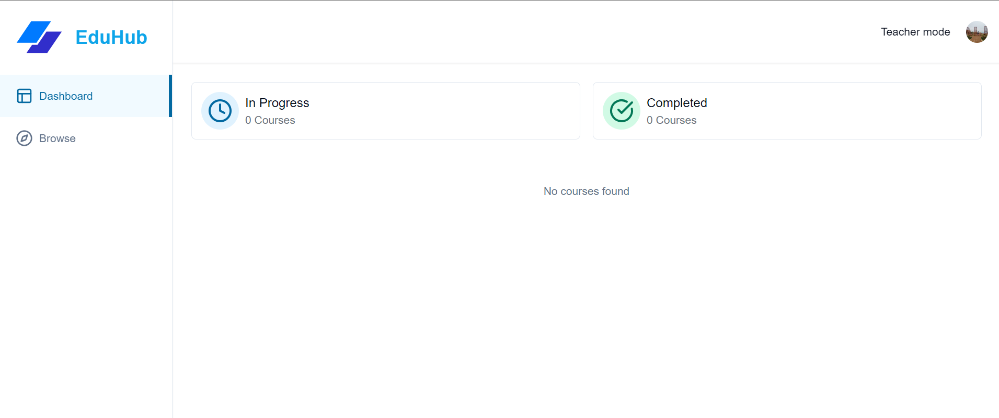
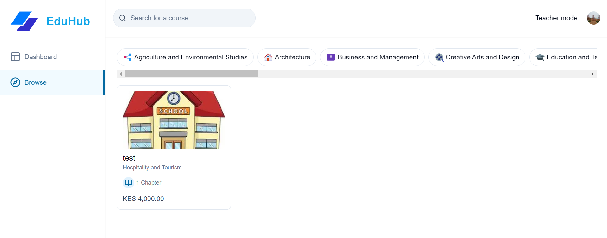
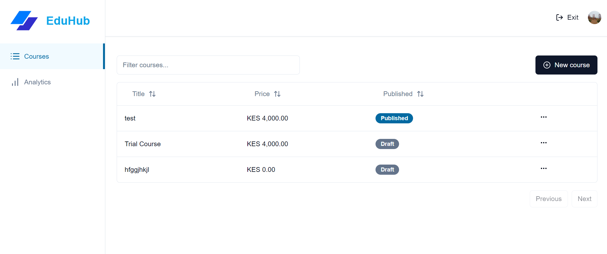
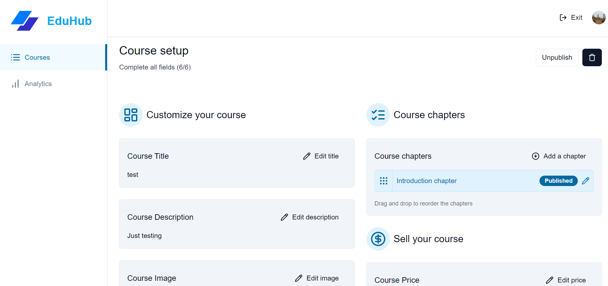
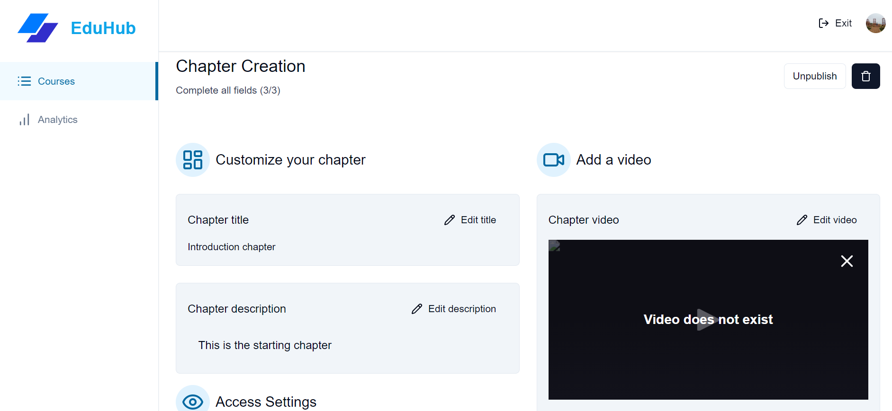
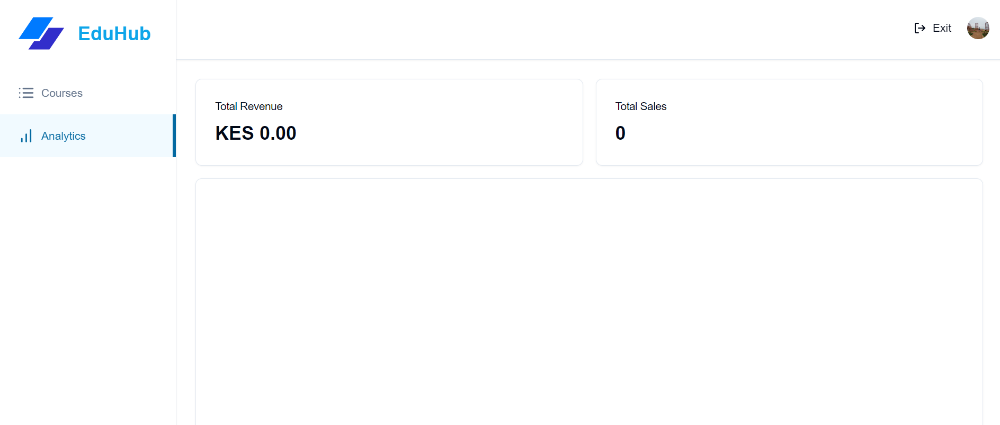
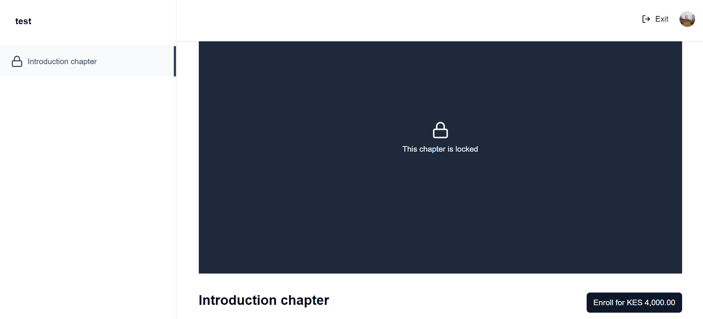

# EduHub: A Comprehensive Learning Management System (LMS)

EduHub is a comprehensive Learning Management System (LMS) built to enhance online learning by providing an intuitive platform for both students and teachers. Designed using cutting-edge technologies like Next.js, React, and Prisma, EduHub offers a rich feature set that makes it easy to create, manage, and access educational content. This platform includes course browsing, video processing, and secure payment options, making it ideal for institutions and independent educators looking to provide high-quality, engaging learning experiences.

## Technologies Used

- **Frontend**: Next.js, React, Tailwind CSS
- **Backend**: Prisma, MySQL (Aiven)
- **Media Management**: Mux for video processing and streaming
- **Payments**: Stripe for secure payments
- **Authentication**: Clerk for user management
- **File Uploads**: UploadThing for file and video uploads


Key Features:

- Browse & Filter Courses
- Purchase Courses using Stripe
- Mark Chapters as Completed or Uncompleted
- Progress Calculation of each Course
- Student Dashboard
- Teacher mode
- Create new Courses
- Create new Chapters
- Easily reorder chapter position with drag and drop
- Upload thumbnails, attachments and videos using UploadThing
- Video processing using Mux
- HLS Video player using Mux
- Rich text editor for chapter description
- Authentication using Clerk
- ORM using Prisma
- MySQL database using Aiven

### Prerequisites

**Node version 20.x.x**

### Cloning the repository

```shell
git clone https://github.com/barasa001/EduHub.git
```

### Install packages

```shell
npm i
```

### Setup .env file


```js
NEXT_PUBLIC_CLERK_PUBLISHABLE_KEY=
CLERK_SECRET_KEY=
NEXT_PUBLIC_CLERK_SIGN_IN_URL=
NEXT_PUBLIC_CLERK_SIGN_UP_URL=
NEXT_PUBLIC_CLERK_AFTER_SIGN_IN_URL=
NEXT_PUBLIC_CLERK_AFTER_SIGN_UP_URL=

DATABASE_URL=

UPLOADTHING_SECRET=
UPLOADTHING_APP_ID=

MUX_TOKEN_ID=
MUX_TOKEN_SECRET=

STRIPE_API_KEY=
NEXT_PUBLIC_APP_URL=http://localhost:3000
STRIPE_WEBHOOK_SECRET=

NEXT_PUBLIC_TEACHER_ID=
```

### Setup Prisma

Add MySQL Database (Aiven)

```shell
npx prisma generate
npx prisma db push

```

### Start the app

```shell
npm run dev
```

## APP INTERFACES

### Teacher Dashboard


### Course Browse Page


### Teacher Page


### Course Setup Page


### Chapter Setup Page


### Teacher Analytics


### Enroll Course


## Deployment Plan

The Learning Management System (LMS) will be hosted on a local server to ensure seamless access and management for users. The deployment process will follow these steps:

1. **Local Server Setup**: The LMS will be deployed on a local server using Node.js and Express to run the backend. We will ensure that the server environment is configured to support Next.js for the frontend.

2. **Database Configuration**: We will use MySQL (Aiven) as our database management system. The database will be set up on Aiven, and we will import the necessary seed data to initialize the LMS.

3. **Application Deployment**: The codebase, which consists of the Next.js frontend and the Prisma backend, will be transferred to the local server's designated web directory. All necessary dependencies will be installed using `npm install`, and environment variables will be configured to ensure seamless connections to the database and other services.

4. **Media Management Integration**: Mux will be integrated for video processing and streaming. We will configure Mux API keys in the environment variables and set up the application to handle video uploads and streaming.

5. **Payment Processing**: Stripe will be configured for secure payment transactions within the LMS. API keys will be securely stored in the environment variables, and the payment flow will be tested to ensure transactions are processed correctly.

6. **User Authentication**: Clerk will be implemented for user management and authentication. The application will be configured to handle user registration, login, and session management using Clerk's SDK.

7. **File Upload Management**: We will utilize UploadThing for managing file and video uploads. The integration will ensure that users can upload files seamlessly, and we will verify that the uploaded files are stored and accessible as intended.

8. **Testing**: After deployment, comprehensive testing will be conducted to ensure all components function correctly on the local server. This will include testing the frontend interface, database connections, video processing with Mux, payment transactions with Stripe, and user authentication with Clerk.

9. **User Access**: Once deployment and testing are complete, users will be granted access to the LMS through the local network. Detailed instructions and access credentials will be provided to authorized users.

This deployment plan outlines the specific technologies and configurations required to successfully host the LMS on a local server.


## VIDEO DEMO
[Watch the video](https://www.loom.com/share/ba02df760a664987847143e196114aa4?sid=a775d46b-c12d-4a6d-8ed7-67680b9309f2)


